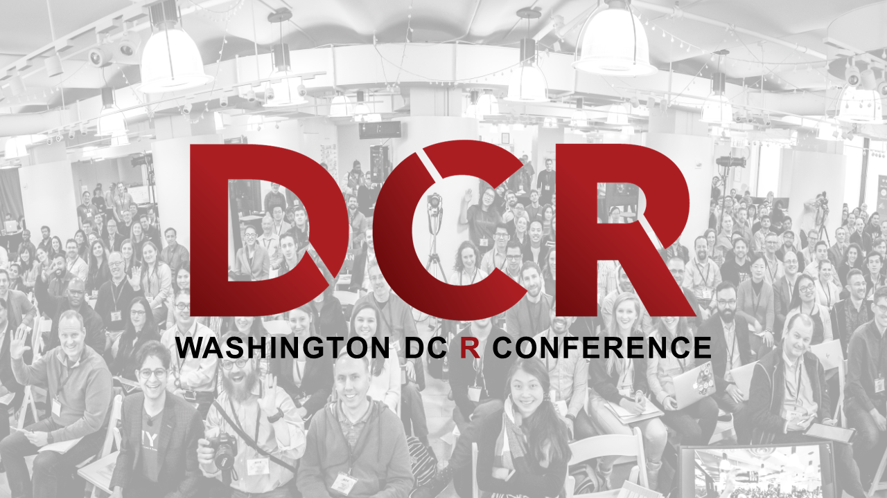

# Washington DC R Conference
### November 8 - 9

After selling out the New York R Conference in each of the last four years, attracting 350+ data scientists from around the world, we are excited to announce that the R conference is back and we are taking it to Washington DC this fall on November 8th and 9th at the Ronald Reagan Building.

For two days in November, the 2018 DCR Conference will feature world-class data scientists sharing cutting-edge research and lessons from the field including Roger Peng, Mara Averick, Max Kuhn, Kelly O’Briant, Dan Chen, Emily Robinson, David Smith and so many more. This will be our first R Conference held in Washington DC.

For more about the conference visit https://dc.rstats.ai and follow us on Twitter at [\@rstatsdc](https://twitter.com/rstatsdc).

You can see a recap of the [NYR Conference](https://nyhackr.org) held this April in NYC here on the [Conference page](nyr.html).
